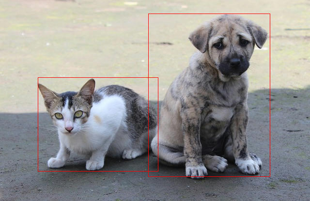

<div align="center">
  <h1><code>MediaPipe-rs</code></h1>
  <p>
    <a href="https://github.com/WasmEdge/mediapipe-rs/actions?query=workflow%3ACI">
      
    </a>
    <a href="https://crates.io/crates/mediapipe-rs">
      
    </a>
    <a href="https://docs.rs/mediapipe-rs">
      
    </a>
  </p>
</div>

# A Rust library for MediaPipe tasks for WasmEdge WASI-NN

## Introduction

* **Easy to use**: low-code APIs such as mediapipe-python.
* **Low overhead**: No unnecessary data copy, allocation, and free during the processing.
* **Flexible**: Users can use custom media bytes as input.
* For TfLite models, the library not only supports all models downloaded from [MediaPipe Solutions] but also supports
  **[TF Hub]** models and **custom models** with essential information.

### Status

* [x] Object Detection
* [x] Image Classification
* [x] Image Segmentation
* [ ] Interactive Image Segmentation
* [x] Gesture Recognition
* [x] Hand Landmark Detection
* [x] Image Embedding
* [x] Face Detection
* [x] Face Landmark Detection
* [ ] Pose Landmark Detection
* [x] Audio Classification
* [x] Text Classification
* [x] Text Embedding
* [ ] Language Detection

## Task APIs

Every task has three types: ```XxxBuilder```, ```Xxx```, ```XxxSession```. (``Xxx`` is the task name)

* ```XxxBuilder``` is used to create a task instance ```Xxx```, which has many options to set.

  example: use ```ImageClassifierBuilder``` to build a ```ImageClassifier``` task.
  ```
  let classifier = ImageClassifierBuilder::new()
        .max_results(3) // set max result
        .category_deny_list(vec!["denied label".into()]) // set deny list
        .gpu() // set running device
        .build_from_file(model_path)?; // create a image classifier
  ```
* ```Xxx``` is a task instance, which contains task information and model information.

  example: use ```ImageClassifier``` to create a new ```ImageClassifierSession```
  ```
  let classifier_session = classifier.new_session()?;
  ```
* ```XxxSession``` is a running session to perform pre-process, inference, and post-process, which has buffers to store
  mid-results.

  example: use ```ImageClassifierSession``` to run the image classification task and return classification results:
  ```
  let classification_result = classifier_session.classify(&image::open(img_path)?)?;
  ```
  **Note**: the session can be reused to speed up, if the code just uses the session once, it can use the task's wrapper
  function to simplify.
  ```
  // let classifier_session = classifier.new_session()?;
  // let classification_result = classifier_session.classify(&image::open(img_path)?)?;
  // The above 2-line code is equal to: 
  let classification_result = classifier.classify(&image::open(img_path)?)?;
  ```

### Available tasks

* vision:
    * gesture recognition: `GestureRecognizerBuilder` -> `GestureRecognizer` -> `GestureRecognizerSession`
    * hand detection: `HandDetectorBuilder` -> `HandDetector` -> `HandDetectorSession`
    * image classification: `ImageClassifierBuilder` -> `ImageClassifier` -> `ImageClassifierSession`
    * image embedding: `ImageEmbedderBuilder` -> `ImageEmbedder` -> `ImageEmbedderSession`
    * image segmentation: `ImageSegmenterBuilder` -> `ImageSegmenter` -> `ImageSegmenterSession`
    * object detection: `ObjectDetectorBuilder` -> `ObjectDetector` -> `ObjectDetectorSession`
    * face detection: `FaceDetectorBuilder` -> `FaceDetector` -> `FaceDetectorSession`
    * face landmark detection: `FaceLandmarkerBuilder` -> `FaceLandmarker` -> `FaceLandmarkerSession`
* audio:
    * audio classification: `AudioClassifierBuilder` -> `AudioClassifier` -> `AudioClassifierSession`
* text:
    * text classification: `TextClassifierBuilder` -> `TextClassifier` -> `TextClassifierSession`

## Examples

### Image classification

```rust
use mediapipe_rs::tasks::vision::ImageClassifierBuilder;

fn main() -> Result<(), Box<dyn std::error::Error>> {
    let (model_path, img_path) = parse_args()?;

    let classification_result = ImageClassifierBuilder::new()
        .max_results(3) // set max result
        .build_from_file(model_path)? // create a image classifier
        .classify(&image::open(img_path)?)?; // do inference and generate results

    // show formatted result message
    println!("{}", classification_result);

    Ok(())
}
```

Example input: (The image is downloaded from https://storage.googleapis.com/mediapipe-assets/burger.jpg)


Example output in console:

```console
$ cargo run --release --example image_classification -- ./assets/models/image_classification/efficientnet_lite0_fp32.tflite ./assets/testdata/img/burger.jpg
    Finished release [optimized] target(s) in 0.01s
     Running `/mediapipe-rs/./scripts/wasmedge-runner.sh target/wasm32-wasi/release/examples/image_classification.wasm ./assets/models/image_classification/efficientnet_lite0_fp32.tflite ./assets/testdata/img/burger.jpg`
ClassificationResult:
  Classification #0:
    Category #0:
      Category name: "cheeseburger"
      Display name:  None
      Score:         0.70625573
      Index:         933
```

### Object Detection

```rust
use mediapipe_rs::postprocess::utils::draw_detection;
use mediapipe_rs::tasks::vision::ObjectDetectorBuilder;

fn main() -> Result<(), Box<dyn std::error::Error>> {
    let (model_path, img_path, output_path) = parse_args()?;

    let mut input_img = image::open(img_path)?;
    let detection_result = ObjectDetectorBuilder::new()
        .max_results(2) // set max result
        .build_from_file(model_path)? // create a object detector
        .detect(&input_img)?; // do inference and generate results

    // show formatted result message
    println!("{}", detection_result);

    if let Some(output_path) = output_path {
        // draw detection result to image
        draw_detection(&mut input_img, &detection_result);
        // save output image
        input_img.save(output_path)?;
    }

    Ok(())
}
```

Example input: (The image is downloaded
from https://storage.googleapis.com/mediapipe-tasks/object_detector/cat_and_dog.jpg)


Example output in console:

```console
$ cargo run --release --example object_detection -- ./assets/models/object_detection/efficientdet_lite0_fp32.tflite ./assets/testdata/img/cat_and_dog.jpg
    Finished release [optimized] target(s) in 0.00s
     Running `/mediapipe-rs/./scripts/wasmedge-runner.sh target/wasm32-wasi/release/examples/object_detection.wasm ./assets/models/object_detection/efficientdet_lite0_fp32.tflite ./assets/testdata/img/cat_and_dog.jpg`
DetectionResult:
  Detection #0:
    Box: (left: 0.12283102, top: 0.38476586, right: 0.51069236, bottom: 0.851197)
    Category #0:
      Category name: "cat"
      Display name:  None
      Score:         0.8460574
      Index:         16
  Detection #1:
    Box: (left: 0.47926134, top: 0.06873521, right: 0.8711677, bottom: 0.87927735)
    Category #0:
      Category name: "dog"
      Display name:  None
      Score:         0.8375256
      Index:         17
```

Example output:


### Text Classification

```rust
fn main() -> Result<(), Box<dyn std::error::Error>> {
    let model_path = parse_args()?;

    let text_classifier = TextClassifierBuilder::new()
        .max_results(1) // set max result
        .build_from_file(model_path)?; // create a text classifier

    let positive_str = "I love coding so much!";
    let negative_str = "I don't like raining.";

    // classify show formatted result message
    let result = text_classifier.classify(&positive_str)?;
    println!("`{}` -- {}", positive_str, result);

    let result = text_classifier.classify(&negative_str)?;
    println!("`{}` -- {}", negative_str, result);

    Ok(())
}
```

Example output in console (use the bert model):

```console
$ cargo run --release --example text_classification -- ./assets/models/text_classification/bert_text_classifier.tflite
    Finished release [optimized] target(s) in 0.01s
     Running `/mediapipe-rs/./scripts/wasmedge-runner.sh target/wasm32-wasi/release/examples/text_classification.wasm ./assets/models/text_classification/bert_text_classifier.tflite`
`I love coding so much!` -- ClassificationResult:
  Classification #0:
    Category #0:
      Category name: "positive"
      Display name:  None
      Score:         0.99990463
      Index:         1

`I don't like raining.` -- ClassificationResult:
  Classification #0:
    Category #0:
      Category name: "negative"
      Display name:  None
      Score:         0.99541473
      Index:         0

```

### Gesture Recognition

```rust
use mediapipe_rs::tasks::vision::GestureRecognizerBuilder;

fn main() -> Result<(), Box<dyn std::error::Error>> {
    let (model_path, img_path) = parse_args()?;

    let gesture_recognition_results = GestureRecognizerBuilder::new()
        .num_hands(1) // set only recognition one hand
        .max_results(1) // set max result
        .build_from_file(model_path)? // create a task instance
        .recognize(&image::open(img_path)?)?; // do inference and generate results

    for g in gesture_recognition_results {
        println!("{}", g.gestures.classifications[0].categories[0]);
    }

    Ok(())
}
```

Example input: (The image is download
from https://storage.googleapis.com/mediapipe-tasks/gesture_recognizer/victory.jpg)


Example output in console:

```console
$ cargo run --release --example gesture_recognition -- ./assets/models/gesture_recognition/gesture_recognizer.task ./assets/testdata/img/gesture_recognition_google_samples/victory.jpg
    Finished release [optimized] target(s) in 0.02s
     Running `/mediapipe-rs/./scripts/wasmedge-runner.sh target/wasm32-wasi/release/examples/gesture_recognition.wasm ./assets/models/gesture_recognition/gesture_recognizer.task ./assets/testdata/img/gesture_recognition_google_samples/victory.jpg`
      Category name: "Victory"
      Display name:  None
      Score:         0.9322255
      Index:         6
```

### Face Landmarks Detection

```rust
use mediapipe_rs::tasks::vision::FaceLandmarkerBuilder;
use mediapipe_rs::postprocess::utils::DrawLandmarksOptions;
use mediapipe_rs::tasks::vision::FaceLandmarkConnections;

fn main() -> Result<(), Box<dyn std::error::Error>> {
    let (model_path, img_path, output_path) = parse_args()?;

    let mut input_img = image::open(img_path)?;
    let face_landmark_results = FaceLandmarkerBuilder::new()
        .num_faces(1) // set max number of faces to detect
        .min_face_detection_confidence(0.5)
        .min_face_presence_confidence(0.5)
        .min_tracking_confidence(0.5)
        .output_face_blendshapes(true)
        .build_from_file(model_path)? // create a face landmarker
        .detect(&input_img)?; // do inference and generate results

    // show formatted result message
    println!("{}", face_landmark_results);

    if let Some(output_path) = output_path {
        // draw face landmarks result to image
        let options = DrawLandmarksOptions::default()
            .connections(FaceLandmarkConnections::get_connections(
                &FaceLandmarkConnections::FacemeshTesselation,
            ))
            .landmark_radius_percent(0.003);

        for result in face_landmark_results.iter() {
            result.draw_with_options(&mut input_img, &options);
        }
        // save output image
        input_img.save(output_path)?;
    }

    Ok(())
}
```

Example input: (The image is downloaded from https://storage.googleapis.com/mediapipe-assets/portrait.jpg)


Example output in console:

```console
$ cargo run --release --example face_landmark -- ./assets/models/face_landmark/face_landmarker.task ./assets/testdata/img/face.jpg ./assets/doc/face_landmark_output.jpg

    Finished release [optimized] target(s) in 4.50s
     Running `./scripts/wasmedge-runner.sh target/wasm32-wasi/release/examples/face_landmark.wasm ./assets/models/face_landmark/face_landmarker.task ./assets/testdata/img/face.jpg ./assets/doc/face_landmark_output.jpg`

FaceLandmarkResult #0
  Landmarks:
    Normalized Landmark #0:
      x:       0.49687287
      y:       0.24964334
      z:       -0.029807145
    Normalized Landmark #1:
      x:       0.49801534
      y:       0.22689381
      z:       -0.05928771
    Normalized Landmark #2:
      x:       0.49707597
      y:       0.23421054
      z:       -0.03364953
```

Example output image:


### Audio Input

Every audio media which implements the trait ```AudioData``` can be used as audio tasks input.
Now the library has builtin implementation to support ```symphonia```, ```ffmpeg```, and raw audio data as input.

Examples for Audio Classification:

```rust
use mediapipe_rs::tasks::audio::AudioClassifierBuilder;

#[cfg(feature = "ffmpeg")]
use mediapipe_rs::preprocess::audio::FFMpegAudioData;
#[cfg(not(feature = "ffmpeg"))]
use mediapipe_rs::preprocess::audio::SymphoniaAudioData;

#[cfg(not(feature = "ffmpeg"))]
fn read_audio_using_symphonia(audio_path: String) -> SymphoniaAudioData {
    let file = std::fs::File::open(audio_path).unwrap();
    let probed = symphonia::default::get_probe()
        .format(
            &Default::default(),
            symphonia::core::io::MediaSourceStream::new(Box::new(file), Default::default()),
            &Default::default(),
            &Default::default(),
        )
        .unwrap();
    let codec_params = &probed.format.default_track().unwrap().codec_params;
    let decoder = symphonia::default::get_codecs()
        .make(codec_params, &Default::default())
        .unwrap();
    SymphoniaAudioData::new(probed.format, decoder)
}

#[cfg(feature = "ffmpeg")]
fn read_video_using_ffmpeg(audio_path: String) -> FFMpegAudioData {
    ffmpeg_next::init().unwrap();
    FFMpegAudioData::new(ffmpeg_next::format::input(&audio_path.as_str()).unwrap()).unwrap()
}

fn main() -> Result<(), Box<dyn std::error::Error>> {
    let (model_path, audio_path) = parse_args()?;

    #[cfg(not(feature = "ffmpeg"))]
        let audio = read_audio_using_symphonia(audio_path);
    #[cfg(feature = "ffmpeg")]
        let audio = read_video_using_ffmpeg(audio_path);

    let classification_results = AudioClassifierBuilder::new()
        .max_results(3) // set max result
        .build_from_file(model_path)? // create a task instance
        .classify(audio)?; // do inference and generate results

    // show formatted result message
    for c in classification_results {
        println!("{}", c);
    }

    Ok(())
}
```

## Use the Session to speed up

The session includes inference sessions (such as TfLite interpreter), input and output buffers, etc.
Explicitly using the session can reuse these resources to speed up.

### Example: Text Classification

Origin :

```rust
use mediapipe_rs::tasks::text::TextClassifier;
use mediapipe_rs::postprocess::ClassificationResult;
use mediapipe_rs::Error;

fn inference(
    text_classifier: &TextClassifier,
    inputs: &Vec<String>
) -> Result<Vec<ClassificationResult>, Error> {
    let mut res = Vec::with_capacity(inputs.len());
    for input in inputs {
        // text_classifier will create new session every time
        res.push(text_classifier.classify(input.as_str())?);
    }
    Ok(res)
}
```

Use the session to speed up:

```rust
use mediapipe_rs::tasks::text::TextClassifier;
use mediapipe_rs::postprocess::ClassificationResult;
use mediapipe_rs::Error;

fn inference(
    text_classifier: &TextClassifier,
    inputs: &Vec<String>
) -> Result<Vec<ClassificationResult>, Error> {
    let mut res = Vec::with_capacity(inputs.len());
    // only create one session and reuse the resources in session.
    let mut session = text_classifier.new_session()?;
    for input in inputs {
        res.push(session.classify(input.as_str())?);
    }
    Ok(res)
}
```

## Use the FFMPEG feature to process video and audio.

When building the library with ```ffmpeg``` feature using cargo, users must set the following environment variables:

* ```FFMPEG_DIR```: the pre-built FFmpeg library path. You can download it from
  https://github.com/yanghaku/ffmpeg-wasm32-wasi/releases.
* ```WASI_SDK``` or (```WASI_SYSROOT``` and ```CLANG_RT```), You can download it from
  https://github.com/WebAssembly/wasi-sdk/releases
* ```BINDGEN_EXTRA_CLANG_ARGS```: set **sysroot** and **target** and **function visibility** for libclang.
  (The sysroot must be **absolute path**).

Example:

```shell
export FFMPEG_DIR=/path/to/ffmpeg/library
export WASI_SDK=/opt/wasi-sdk
export BINDGEN_EXTRA_CLANG_ARGS="--sysroot=/opt/wasi-sdk/share/wasi-sysroot --target=wasm32-wasi -fvisibility=default"

# Then run cargo
```

## GPU and TPU support

The default device is CPU, and user can use APIs to choose device to use:

```rust
use mediapipe_rs::tasks::vision::ObjectDetectorBuilder;

fn create_gpu(model_blob: Vec<u8>) {
    let detector_gpu = ObjectDetectorBuilder::new()
        .gpu()
        .build_from_buffer(model_blob)
        .unwrap();
}

fn create_tpu(model_blob: Vec<u8>) {
    let detector_tpu = ObjectDetectorBuilder::new()
        .tpu()
        .build_from_buffer(model_blob)
        .unwrap();
}
```

## Notice

This work is made possible by **Google's work on [Mediapipe]**.

## Related Links

- [LFX Workspace: A Rust library crate for mediapipe models for WasmEdge NN](https://github.com/WasmEdge/WasmEdge/issues/2355)
- [WasmEdge]
- [MediaPipe]
- [wasi-nn safe]
- [wasi-nn specification]
- [wasi-nn]

[wasi-nn]: https://github.com/bytecodealliance/wasi-nn

[wasi-nn specification]: https://github.com/WebAssembly/wasi-nn/

[wasi-nn safe]: https://github.com/yanghaku/wasi-nn-safe

[WasmEdge]: https://github.com/WasmEdge/WasmEdge

[MediaPipe]: https://github.com/google/mediapipe

[MediaPipe Solutions]: https://developers.google.com/mediapipe/solutions/

[TF Hub]: https://tfhub.dev/

## License

This project is licensed under the Apache 2.0 license. See [LICENSE] for more details.

[LICENSE]: LICENSE
